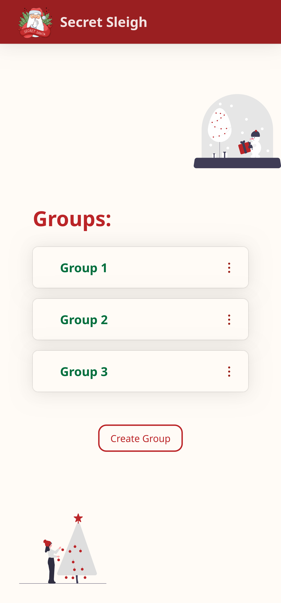
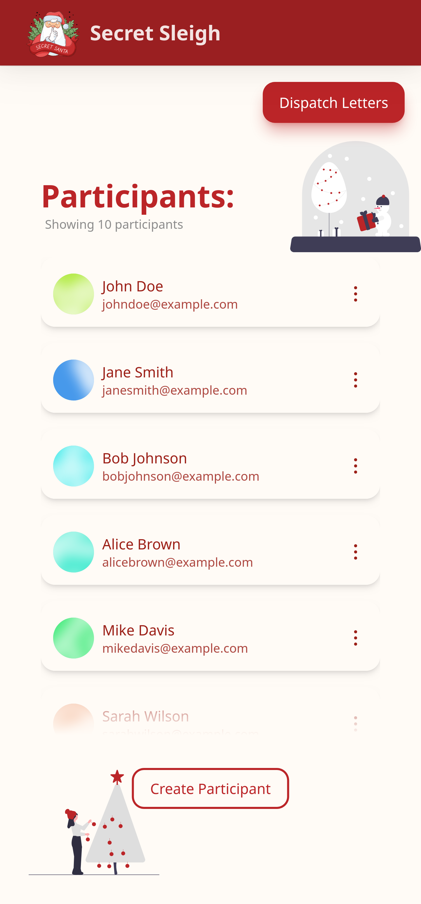

# Secret Santa App

A full-stack web application for managing Secret Santa gift exchanges.

## Features

- Create and manage groups
- Add and manage participants in each group
- Generate and send secret santa matches to participants via email
- Allows participants to view their secret santa matches
- Allows organizers to view all participants and their matches in a group
- Allows organizers to send reminders to participants

## Technologies Used

- Node.js
- Express.js
- MongoDB
- React
- NextUI component library
- Tailwind CSS
- Nodemailer
- React Query
- React Router

## License

This project is licensed under the MIT License. See the LICENSE file for details.

## Acknowledgments

- This project was inspired by the Secret Santa app built by The Net Ninja
- The email template used in this project was designed by HTML Email
- The logo used in this project was designed by Freepik

## Screenshots

## Contributing

Contributions are welcome! If you would like to contribute, please fork the repository and submit a pull request.
